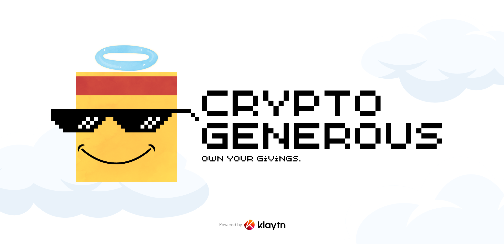

A Dapp where you can donate to a vetted charity/philanthropy project and get an NFT for it that is valued to the donation amount. You can then, in future, sell the NFT whenever you have financial troubles for the same amount or lower.

- Projects vetted by DAO of field experts.
- Projects are NFTs and donation is done on chain.
- Use cryptocoins for donating and get a "Generous NFT". 
- Burn or Sell owned Generous NFTs on the app. 💰
- DAO and Governance Tokens.
- ✨ Specials for  Top Donors.

## Demo (on polygon mumbai)

🚀 link: [cryptogenerous.netlify.app/](https://cryptogenerous.netlify.app/)

## Why?

- To change the way we view charity and donations.
- Promote transparency in philanthropy.
- Help overcome cold feet due to fear of future while donating.
- Eliminate unfair censorships on donations.

## Project Structure

- **Frontend I** - For Users (React)

- **Contract I** - Main contract (ERC721 based) (Solidity)

- **IPFS & Filecoin** - For storage and metadata (NFT.storage)

- **DAO & Governance Token** - 

--